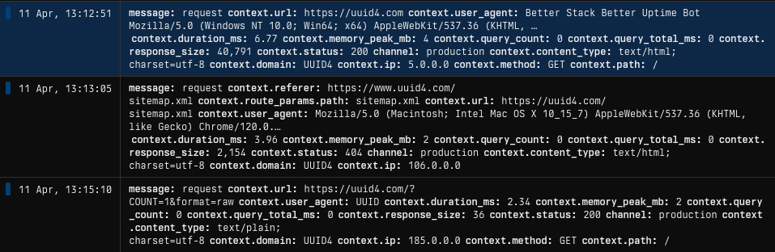

# Laravel Axiom Log

Batched log handler for [Axiom](https://axiom.co) in Laravel. Buffers log records in memory and flushes them as a single POST to Axiom's ingest API at end of request (or when batch size threshold is reached).

Also comes with an optional request logging middleware - see [Request logging middleware](#request-logging-middleware-optional) below.

## Installation

```bash
composer require devtime-ltd/laravel-axiom-log
```

The service provider is auto-discovered. It registers an `axiom` log channel automatically.

## Configuration

Set environment variables:

```env
AXIOM_LOG_TOKEN=your-api-token
AXIOM_LOG_DATASET=your-dataset
```

Optional:

```env
AXIOM_LOG_CHANNEL_NAME=axiom
AXIOM_LOG_HOST=https://api.axiom.co
AXIOM_LOG_BATCH_SIZE=50
```

If desired, config file can be published via the following:

```bash
php artisan vendor:publish --tag=axiom-log-config
```

### Using the Axiom log channel

Add `axiom` to your `LOG_STACK`:

```env
LOG_STACK=single,axiom
```

Or use it directly:

```php
Log::channel('axiom')->info('something happened', ['key' => 'value']);
```

---

## Request logging middleware (optional)

Included is an optional `LogRequest` middleware that logs structured request data (method, URL, status, duration, query stats, memory). It can be used with, or independently of, the log handler.



### Setting up request logging middleware

Register the middleware in `bootstrap/app.php`:

```php
use DevtimeLtd\LaravelAxiomLog\LogRequest;

->withMiddleware(function (Middleware $middleware) {
    $middleware->prepend(LogRequest::class);
})
```

Set the channel to log to:

```env
LOG_REQUESTS_CHANNEL=axiom
```

Can also pass multiple channels (e.g. `axiom,betterstack`) for logging to multiple providers. Leave unset to disable, the middleware is a no-op without this env var.

> **Note:** Logging happens inline in `handle()` rather than `terminate()`. We found `terminate()` didn't fire in all hosting setups. The overhead should be minimal since the actual Axiom POST is batched and sent when the handler closes during PHP shutdown.

### Logged fields

| Field            | Description                                 |
| ---------------- | ------------------------------------------- |
| `method`         | HTTP method                                 |
| `url`            | Full URL                                    |
| `path`           | Request path                                |
| `route`          | Named route (if any)                        |
| `route_params`   | Route parameters (raw values, pre-binding)  |
| `status`         | Response status code                        |
| `content_type`   | Response Content-Type                       |
| `response_size`  | Response body size in bytes                 |
| `user_id`        | Authenticated user ID (null if guest)       |
| `ip`             | Client IP (supports obfuscation, see below) |
| `user_agent`     | User agent string                           |
| `referer`        | Referer header                              |
| `duration_ms`    | Total request time in milliseconds          |
| `memory_peak_mb` | Peak memory usage                           |
| `query_count`    | Number of database queries                  |
| `query_total_ms` | Total time spent in database queries        |
| `slow_queries`   | Queries exceeding the slow query threshold  |

### Request logging options

These options are set in the published `config/axiom.php` under `request_logging`:

#### Database query collection

Disable query measurement to skip the `DB::listen()` overhead:

```php
'collect_queries' => false,
```

This omits `query_count`, `query_total_ms`, and `slow_queries` from the log entry. Default: `true`.

#### Slow query threshold

Threshold in milliseconds for capturing slow queries:

```php
'slow_query_threshold' => 500,
```

Set to `null` to disable slow query collection while still tracking `query_count` and `query_total_ms`. Default: `100`.

#### IP obfuscation

Mask client IPs using the built-in `ObfuscateIp` class. Supports four levels.

| Level | IPv4 example (`198.51.100.123`) | IPv6  |
| ----- | ------------------------------- | ----- |
| 1     | `198.51.100.0`                  | `/96` |
| 2     | `198.51.0.0`                    | `/64` |
| 3     | `198.0.0.0`                     | `/32` |
| 4     | `0.0.0.0`                       | `::`  |

```php
use DevtimeLtd\LaravelAxiomLog\ObfuscateIp;

'obfuscate_ip' => ObfuscateIp::level(2),
```

You can also pass any callable for custom masking:

```php
'obfuscate_ip' => fn (?string $ip) => 'redacted',
```

Default: `false` (no masking).

### Extending log entries

Use `LogRequest::extend()` to add project-specific fields, or overwrite default ones. Call this in your `AppServiceProvider::boot()`:

```php
use DevtimeLtd\LaravelAxiomLog\LogRequest;

LogRequest::extend(function ($request, $response, $entry) {
    $entry['tenant_id'] = $request->header('X-Tenant-ID');
    return $entry;
});
```

### Custom log entry

If you wish to completely replace the default log entries fields with your own, you can use `LogRequest::using()`. The callback receives the request, response, and a measurements array:

```php
use DevtimeLtd\LaravelAxiomLog\LogRequest;

LogRequest::using(function ($request, $response, $measurements) {
    return [
        'method' => $request->method(),
        'path' => $request->path(),
        'status' => $response?->getStatusCode(),
        'duration_ms' => $measurements['duration_ms'],
    ];
});
```

`$measurements` contains the collected metrics based on config: `duration_ms`, `memory_peak_mb`, and when query collection is enabled, `query_count`, `query_total_ms`, `slow_queries`.

Note that `extend()` runs after `using()`, so you can utilise both in a request lifecycle.

## Testing

```bash
composer test
```

## License

MIT
